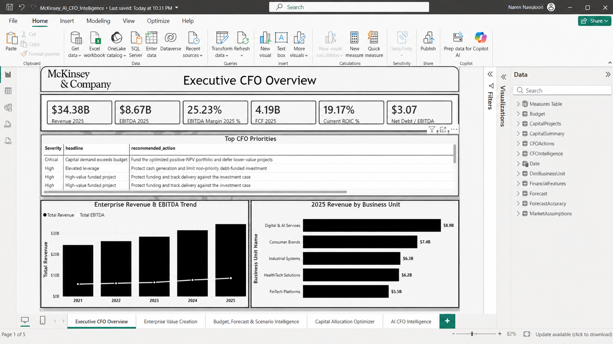
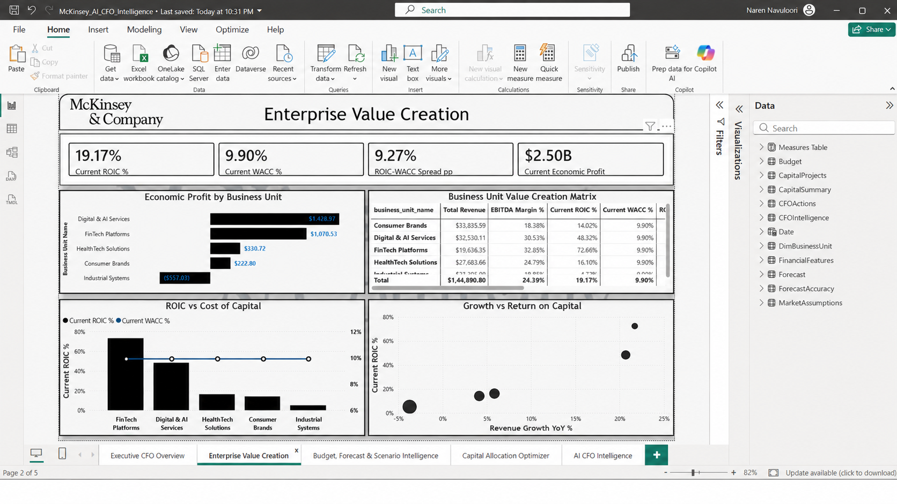
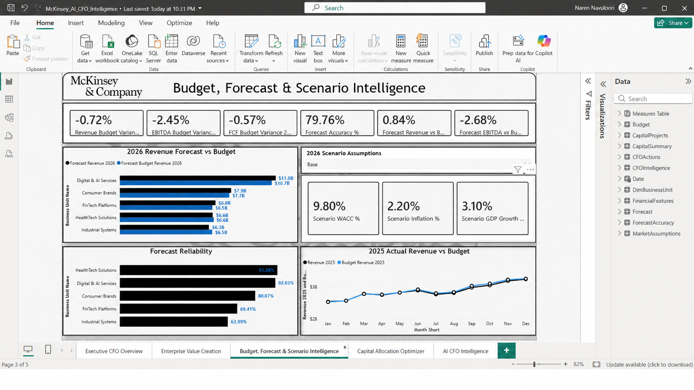
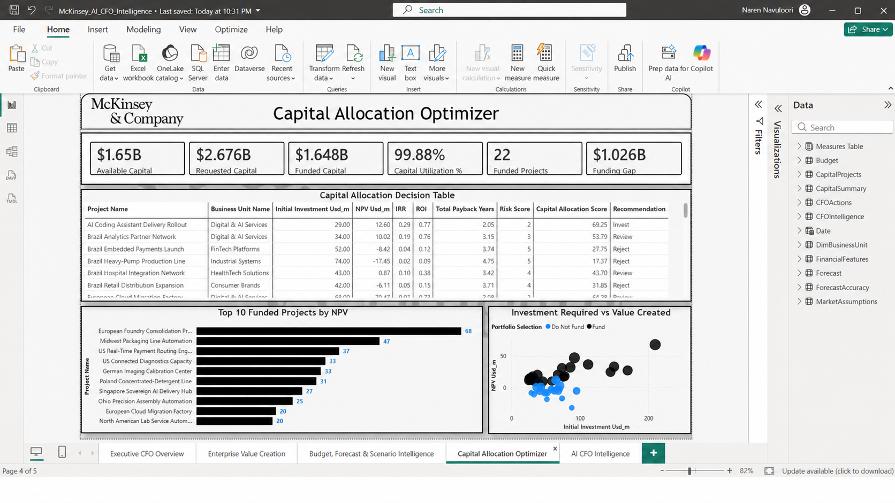
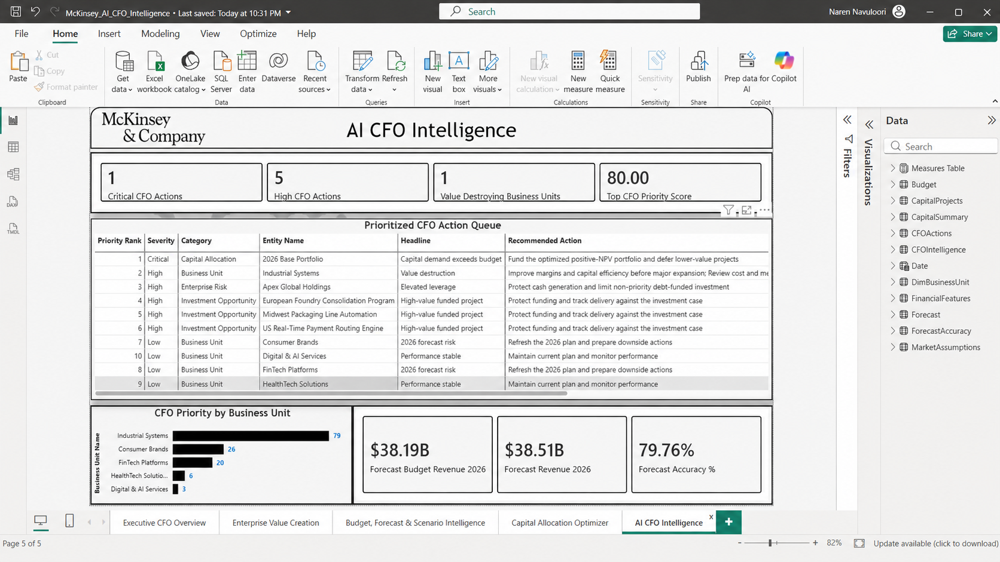
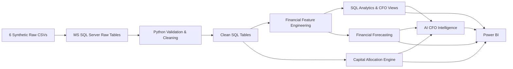

# End-to-End McKinsey Enterprise Value Creation, Capital Allocation & AI CFO Intelligence Platform


> **Independent synthetic portfolio project inspired by publicly available corporate-finance and value-creation practices. It is not affiliated with, endorsed by, commissioned by, or representative of confidential work performed by McKinsey & Company. All company and financial data are synthetic.**

## Executive Summary

This project builds an end-to-end **CFO decision-support platform** for a fictional diversified enterprise, **Apex Global Holdings**. It combines financial performance analytics, value-creation measurement, budgeting, forecasting, capital allocation, and explainable CFO intelligence into one integrated workflow using **MS SQL Server, Python, and Power BI**.

The core business question is:

> **Where is the enterprise creating or destroying economic value, where should the next unit of capital be allocated, what is likely to happen next, and what should the CFO act on first?**

### Key analytical outcomes

| Area | Result |
|---|---:|
| 2025 Revenue | **$34.38B** |
| 2025 EBITDA | **$8.67B** |
| 2025 EBITDA Margin | **25.2%** |
| 2025 Free Cash Flow | **$4.19B** |
| Enterprise ROIC | **19.2%** |
| WACC | **9.9%** |
| ROIC - WACC Spread | **+9.3 pp** |
| Economic Profit | **~$2.50B** |
| Net Debt / EBITDA | **3.07x** |
| Capital Requested | **$2.676B** |
| 2026 Base Capital Budget | **$1.650B** |
| Funding Gap | **$1.026B** |
| Optimized Portfolio | **22 projects / $1.648B deployed** |
| Optimized Portfolio NPV | **~$494.84M** |

A major business-unit finding is **Industrial Systems**, which produces approximately **4.7% ROIC vs 9.9% WACC**, a negative spread of about **-5.2 percentage points**, and approximately **-$557M economic profit** at the latest historical period. This creates a clear turnaround and capital-discipline case.

---

## Power BI Dashboard

### 1. Executive CFO Overview


### 2. Enterprise Value Creation


### 3. Budget, Forecast & Scenario Intelligence


### 4. Capital Allocation Optimizer


### 5. AI CFO Intelligence


---

## Business Problem

A CFO needs more than a P&L dashboard. The decision problem spans five connected areas:

1. **Enterprise Financial Performance** - Revenue, EBITDA, margins, NOPAT, FCF and leverage.
2. **Enterprise Value Creation** - ROIC, WACC, ROIC-WACC spread and Economic Profit.
3. **Planning & Forecasting** - Budget variance, 2026 forecasts, forecast accuracy and Bear/Base/Bull assumptions.
4. **Capital Allocation** - NPV, IRR, ROI, payback, strategic priority, project risk and constrained portfolio optimization.
5. **AI CFO Intelligence** - Explainable risk prioritization and evidence-based executive recommendations.

---

## Solution Architecture



---

## Dataset Design

The project uses six relational synthetic datasets:

| Dataset | Purpose | Logical Clean Rows |
|---|---|---:|
| `business_units.csv` | Business-unit master | 5 |
| `financial_performance.csv` | Monthly P&L and reinvestment drivers | 1,200 |
| `balance_sheet.csv` | Working capital, fixed assets, debt and cash | 1,200 |
| `budget_forecast.csv` | 2024-2026 budgets | 720 |
| `capital_projects.csv` | 40 proposed investments | 40 |
| `market_assumptions.csv` | WACC, macro and scenario assumptions | 20 |

Historical operating data covers **January 2021 to December 2025** across five business units and four regions. The raw files intentionally contain a small number of duplicates, missing numeric values, and plausible outliers so the validation and cleaning pipeline has realistic work to perform.

### Business units

- Digital & AI Services
- Consumer Brands
- HealthTech Solutions
- Industrial Systems
- FinTech Platforms

### Regions

- North America
- Europe
- Asia Pacific
- Latin America

---

## Financial KPI Framework

### Operating Performance

- Revenue
- Revenue Growth
- EBITDA
- EBITDA Margin
- EBIT
- NOPAT
- Free Cash Flow

### Value Creation

```text
NOPAT = EBIT x (1 - Effective Tax Rate)

Net Working Capital = Accounts Receivable + Inventory - Accounts Payable

Invested Capital = Net Working Capital + Net Fixed Assets

ROIC = TTM NOPAT / Average Invested Capital

ROIC-WACC Spread = ROIC - WACC

Economic Profit = NOPAT - (Average Invested Capital x WACC)
```

The project deliberately uses a simplified **operating invested-capital** definition to keep the analysis transparent and consistent at business-unit level.

---

## Data Validation & Cleaning

The raw layer is preserved unchanged. Python creates a separate clean analytical layer.

Key validation and cleaning steps include:

- duplicate detection and removal
- missing-value treatment using business-unit / region time-series interpolation
- numeric and date standardization
- business-key and region validation
- financial-rule checks
- WACC > terminal-growth validation
- outlier flagging without blindly deleting valid business events

This preserves genuine signals such as Industrial Systems' high capital intensity and FinTech investment volatility.

---

## Financial Feature Engineering

`03_financial_feature_engineering.py` creates the analytical finance layer with metrics including:

- EBITDA and EBITDA Margin
- EBIT and NOPAT
- Net Working Capital
- Invested Capital
- Net Debt
- Change in NWC
- Free Cash Flow
- YoY Revenue Growth
- TTM NOPAT and EBITDA
- Average Invested Capital
- ROIC
- ROIC-WACC Spread
- Economic Profit
- Net Debt / EBITDA
- Value Creation classification

---

## SQL Analytics

The SQL layer contains exactly six files:

```text
sql/
├── 01_data_quality_checks.sql
├── 02_financial_performance_analysis.sql
├── 03_value_creation_analysis.sql
├── 04_budget_variance_analysis.sql
├── 05_capital_allocation_analysis.sql
└── 06_cfo_intelligence_views.sql
```

The final SQL script creates reusable CFO views for downstream reporting while keeping the raw and clean layers separate.

---

## Financial Forecasting

The forecasting engine predicts **2026 Revenue, EBITDA and Free Cash Flow** by business unit.

### Model design

- Historical period: 2021-2025
- Training: 2021-2024
- Back-test: 2025
- Models compared:
  - 12-month Moving Average
  - Holt-Winters Exponential Smoothing
- Selection metric: MAPE
- Final model: best model selected separately for each business unit and metric

### Back-test performance

| Metric | Average Forecast Accuracy |
|---|---:|
| Revenue | **~97.1%** |
| EBITDA | **~93.8%** |
| Free Cash Flow | **~48.3%** |

Revenue and EBITDA are highly forecastable in the synthetic history, while FCF is intentionally less stable because it contains CAPEX and working-capital volatility. This is treated as a **risk signal**, not hidden or artificially improved.

---

## Capital Allocation Engine

The project evaluates 40 proposed investments using:

- NPV
- IRR
- ROI
- Payback Period
- Strategic Priority
- Risk Score
- Capital Allocation Score

### Capital Allocation Score

```text
35% NPV
20% IRR
10% ROI
10% Payback
15% Strategic Priority
10% Inverse Risk
```

NPV remains the primary economic metric. The weighted score supports management interpretation but does not replace value creation.

### Portfolio optimization

The 2026 Base case has:

- **$2.676B** requested capital
- **$1.650B** available capital
- **$1.026B** funding gap

A transparent dynamic-programming / 0-1 knapsack approach selects the combination of positive-NPV, hurdle-clearing projects that maximizes total NPV within the budget.

**Optimized result:** approximately **22 funded projects**, **$1.648B deployed**, and **$494.84M portfolio NPV**.

---

## AI CFO Intelligence Engine

The CFO intelligence engine is deliberately explainable and does **not** depend on a paid LLM or external API.

### CFO Priority Score

```text
35% Value-Destruction Severity
25% EBITDA Budget-Miss Severity
20% FCF Deterioration Severity
20% Forecast Risk Severity
```

The engine creates:

- CFO Priority Score
- Critical / High / Medium / Low severity
- key issue
- evidence-based executive insight
- recommended action
- enterprise leverage alert
- capital-allocation alert
- top investment opportunities

Every recommendation remains traceable to calculated financial metrics.

---

## Power BI Report Pages

The report intentionally uses only **5 pages** to avoid congestion:

1. **Executive CFO Overview** - enterprise KPIs, trends, BU performance and top priorities.
2. **Enterprise Value Creation** - ROIC vs WACC, Economic Profit and growth-vs-return analysis.
3. **Budget, Forecast & Scenario Intelligence** - actual vs plan, 2026 forecast, accuracy and Bear/Base/Bull assumptions.
4. **Capital Allocation Optimizer** - requested vs available capital, project economics and funded portfolio.
5. **AI CFO Intelligence** - prioritized risks, opportunities and executive actions.

---

## Project Structure

```text
End-to-End-McKinsey-Enterprise-Value-Creation-Capital-Allocation-and-AI-CFO-Intelligence-Platform/
│
├── data/
│   ├── raw/
│   └── processed/
│
├── sql/
│   ├── 01_data_quality_checks.sql
│   ├── 02_financial_performance_analysis.sql
│   ├── 03_value_creation_analysis.sql
│   ├── 04_budget_variance_analysis.sql
│   ├── 05_capital_allocation_analysis.sql
│   └── 06_cfo_intelligence_views.sql
│
├── python/
│   ├── 01_data_validation.py
│   ├── 02_data_cleaning.py
│   ├── 03_financial_feature_engineering.py
│   ├── 04_financial_forecasting.py
│   ├── 05_capital_allocation.py
│   └── 06_ai_cfo_intelligence.py
│
├── power-bi/
│   ├── McKinsey_AI_CFO_Intelligence.pbix
│   └── screenshots/
│       ├── 01_executive_cfo_overview.png
│       ├── 02_enterprise_value_creation.png
│       ├── 03_budget_forecast_scenario_intelligence.png
│       ├── 04_capital_allocation_optimizer.png
│       └── 05_ai_cfo_intelligence.png
│
├── README.md
├── requirements.txt
└── McKinsey_Finance_Analytics_Report.pdf
```

---

## Technology Stack

| Layer | Technology |
|---|---|
| Database | Microsoft SQL Server |
| Data Validation & Cleaning | Python, pandas, NumPy |
| SQL Connectivity | SQLAlchemy, pyodbc |
| Forecasting | statsmodels |
| Investment Analytics | NumPy Financial |
| BI & DAX | Microsoft Power BI |
| Portfolio Optimization | Python dynamic programming |

---

## How to Run

### 1. Install dependencies

```bash
pip install -r requirements.txt
```

### 2. Create the SQL database

Create:

```text
McKinsey_CFO_Intelligence
```

Import the six raw CSV files using **SSMS -> Tasks -> Import Flat File**.

### 3. Update SQL Server connection

In each Python file, replace:

```python
SERVER = r"YOUR_SERVER_NAME"
```

with your local SQL Server instance.

### 4. Run the Python pipeline

```bash
python python/01_data_validation.py
python python/02_data_cleaning.py
python python/03_financial_feature_engineering.py
python python/04_financial_forecasting.py
python python/05_capital_allocation.py
python python/06_ai_cfo_intelligence.py
```

### 5. Run SQL analytics

Execute the six SQL scripts in numerical order.

### 6. Open Power BI

Open:

```text
power-bi/McKinsey_AI_CFO_Intelligence.pbix
```

Refresh only when the SQL source is available. The project uses **Import mode** so the saved PBIX contains the imported model for portfolio viewing.

---

## Key Business Insights

- Apex Global Holdings grows to approximately **$34.38B revenue** in 2025 with a **25.2% EBITDA margin**.
- Enterprise ROIC of approximately **19.2%** exceeds **9.9% WACC**, creating a strong positive value-creation spread.
- **Industrial Systems** is the clearest turnaround case with approximately **4.7% ROIC**, below WACC, and about **-$557M Economic Profit**.
- Enterprise **Net Debt / EBITDA is ~3.07x**, triggering the project's elevated-leverage monitoring threshold.
- Revenue and EBITDA forecasts show strong back-test accuracy, while FCF forecast volatility highlights the need for closer cash planning.
- Requested project capital exceeds the 2026 Base budget by **$1.026B**, requiring explicit prioritization.
- The optimized portfolio deploys nearly all available capital while maximizing positive NPV.

---

## What This Project Demonstrates

- end-to-end analytics project design
- relational data modelling
- SQL Server ingestion and analytics
- Python validation and cleaning
- corporate-finance KPI engineering
- forecasting and model evaluation
- investment appraisal
- constrained capital allocation
- explainable decision intelligence
- executive Power BI storytelling

---

## Disclaimer

This is an **independent synthetic portfolio project** created for learning and demonstration purposes. It uses fictional company data and does not contain confidential information from McKinsey & Company or any real client. The project name is used only to communicate the consulting-style corporate-finance problem being demonstrated.

---

**Created by Naren Navuloori**  
GitHub: [narennavuloori-data](https://github.com/narennavuloori-data)
